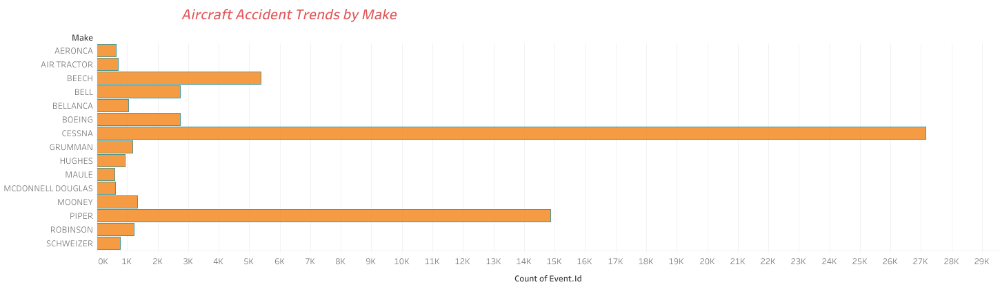
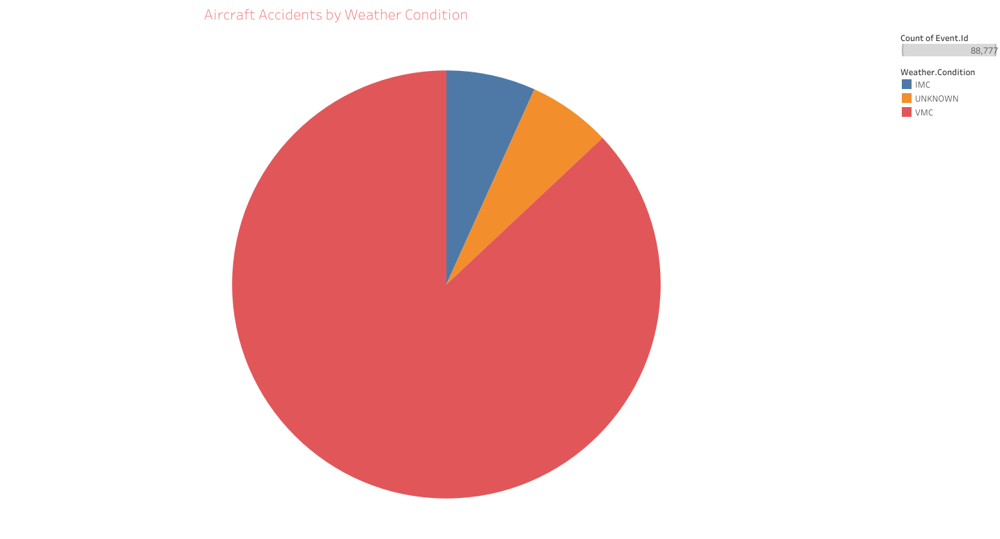
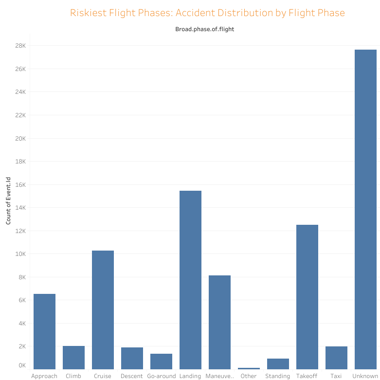
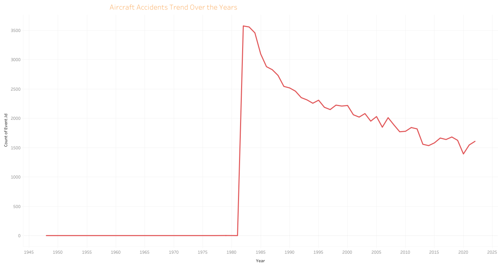

# Aircraft Accident Analysis

## Overview
This project analyzes aircraft accident data to identify the safest aircraft models for purchase. The goal is to provide insights into accident trends, weather conditions, and the riskiest flight phases. By leveraging data-driven analysis, we aim to help stakeholders make informed decisions to minimize operational risks in aviation.

## Business Understanding
### Stakeholders:
- Aircraft buyers and operators
- Aviation safety analysts
- Insurance companies
- Regulatory bodies

### Key Business Questions:
1. Which aircraft makes and models have the highest accident rates?
2. What impact does weather have on aircraft accidents?
3. Which phases of flight are the riskiest?
4. What trends can be observed in aircraft accidents over time?

## Data Understanding and Analysis
### Source of Data
The dataset used in this analysis is sourced from historical aircraft accident reports available on Kaggle. It is called Aviation Accident Database & Synopses, up to 2023. It contains information on accident events, aircraft details, weather conditions, and injury severity.

### Description of Data
The dataset includes:
- **Aircraft details** (Make, Model, Number of Engines, etc.)
- **Accident details** (Date, Location, Weather Conditions, Phase of Flight, etc.)
- **Injury information** (Fatalities, Minor Injuries, Uninjured, etc.)

### Key Visualizations
#### 1. Aircraft Accidents Trend Over the Years
*Description: A line chart showing the trend of accidents over time.*

#### 2. Riskiest Flight Phases
*Description: A bar chart depicting accident counts by phase of flight.*

#### 3. Impact of Weather Conditions on Accidents
*Description: A pie chart showing accident distribution under different weather conditions.*

#### 4. Accidents by Aircraft Make (Bar Chart)
*Description:Identifies which aircraft makes have the highest accident counts.*

## Conclusion
### Summary of Findings
1. **Aircraft Make and Model Risk:** Certain aircraft manufacturers, such as Cessna and Piper, have higher accident frequencies. This suggests that buyers should consider safer alternatives.
2. **Weather Conditions:** The majority of accidents occur during Visual Meteorological Conditions (VMC), suggesting that operational factors, rather than poor weather, are a major contributor to accidents.
3. **Riskiest Flight Phases:** The takeoff and landing phases account for most accidents, indicating the need for enhanced safety measures during these critical moments.

By analyzing these factors, we can help aviation stakeholders make safer investment decisions and improve overall flight safety.

---

### How to Explore This Analysis
- The interactive Tableau dashboard can be accessed [here](https://public.tableau.com/views/AviationSafetyInsights_17430984497510/Dashboard1?:language=en-US&:sid=&:redirect=auth&:display_count=n&:origin=viz_share_link).
- The cleaned dataset is available in this repository as `aircraft_accidents_cleaned.csv`.
- The full analysis and visualizations are in the Jupyter Notebook.

---

### Repository Structure

- `README.md` : Project overview and findings.
- `Jupyter Notebook.ipynb` : Contains the full analysis and visualizations.
- `aircraft_accidents_cleaned.csv` : The cleaned dataset.
- `AviationData.csv` : The raw dataset.
- `USState_Codes.csv` : Supplementary dataset for state codes.
- `visualizations/` : Folder containing saved images of key charts.

This project provides a data-driven approach to identifying safe aircraft investments by analyzing historical accident data and visualizing key trends.

